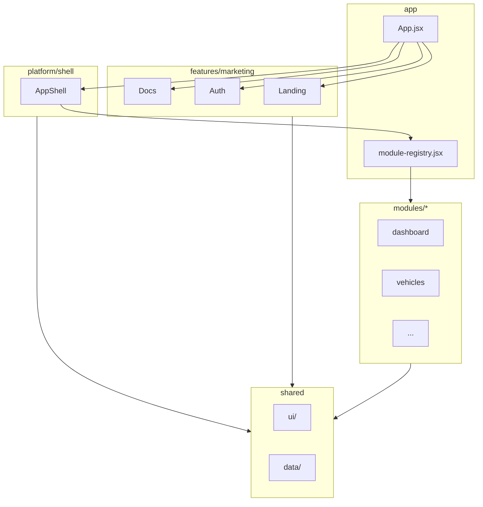

# Arquitectura

## Capas

## Responsabilidades

| Capa | Responsabilidad | No debe |
|------|-----------------|---------|
| `app/` | Routing de pantallas (landing/login/app), registro de módulos | Contener UI de negocio |
| `platform/` | Shell persistente: nav, topbar, layout | Lógica de módulos |
| `features/` | Flujos transversales fuera del shell | Datos de un módulo específico |
| `modules/` | Pantallas de negocio autocontenidas | Importar entre módulos (usar `shared/`) |
| `shared/` | UI primitiva, helpers, mocks | Conocer routing global |

## Navegación

- Estado de pantalla: `App.jsx` (`landing` | `login` | `register` | `forgot` | `docs` | `app`)
- Módulo activo: `localStorage` key `cmocs.active`
- Sidebar colapsado: `cmocs.collapsed`
- Grupos nav abiertos: `cmocs.navOpen`

## Design system

- Tokens CSS en `:root` → `src/styles/design-system.css`
- Componentes: `Logo`, `Btn`, `Badge`, `Card`, `Stat`, … → `src/shared/ui/primitives.jsx`
- Helpers de módulo: `PageHead`, `Drawer`, `BarChart`, … → `src/shared/ui/module-common.jsx`
- Iconos: `lucide-react` vía `src/shared/ui/Icon.jsx`

## Portación desde diseño

El prototipo HTML vive en `.design-bundle/cmocs/project/`. El script `scripts/port-design.mjs` genera/actualiza archivos en `src/`. **No** copies el bundle.jsx del prototipo — usamos ES modules nativos.
